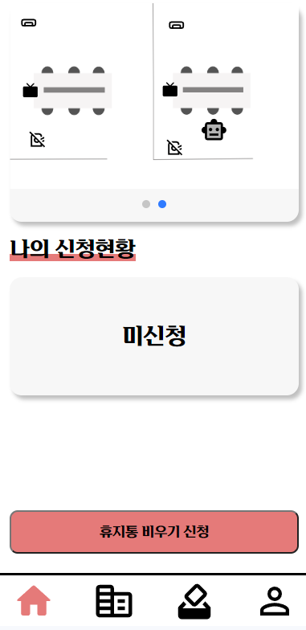
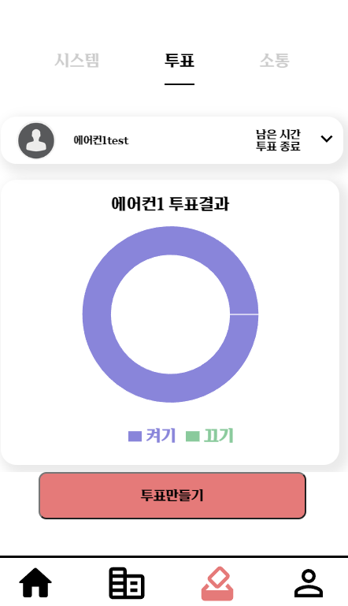

## 🤖 일사로(일하는 사무실 로봇)

---

### 회사 회의실 예약 및 쓰레기통 정리등 업무를 수행해주는 로봇 서비스

### SSAFY 9기 특화 프로젝트

## 팀원 소개

---

**김성민** : `팀장` , `Back`, `Infra` : 서버 배포, Front API 제작, Ros API 제작

**김민겸** : `Ros` : localizer 제작, Back end 통신, 미션 수행 로직 제작

**김택우** : `Ros` : 자율주행,Back end 통신 수행

**박성민** : `Ros` : 사물인식,custom map 제작

**김태형** : `FrontEnd` : 프런트 팀장, 메인페이지(쓰레기통 신청 및 신청현황), 회의실 페이지(회의실 예약현황,예약), 로봇투표, 일반투표 페이지, MapSlice2

**임철성** : `FrontEnd` : 홈페이지/로그인 페이지, 회원가입 페이지, 소통 페이지, 마이페이지, MapSlice1

## 🔗 프로젝트 개요

---

### 💡 기획 배경

 현재 우리나라에서 로봇을 주로 사용하고 있는 환경은 식당에서 음식을 정해진 경로까지 배달해주는 로봇과 비슷한 의미로 일부 테스트 중인 음식 배달 로봇 정로가 있으며 사무실에 로봇을 적용해서 테스트 중인 회사는 네이버가 실행중이며 이들 또한 마찬가지로 택배를 자리 주인에게 가져다주기 정도의 느낌으로 실행하고 있으며 우리는 이러한 로봇의 서비스를 대형 회사들만 적용하는것이 아닌 중소기업들도 이를 적용할 수 있게 하고 적은 비용으로 이를 적용할 수 있게 기획한 **가벼운 사무업(전자제품 작동, 회의실 예약 등)을 수행해주는 초기의 사무실 로봇** 서비스를 고안하였다.

### 📅 프로젝트 진행 기간

2023.08.28 ~ 2023.10.06

## 🖇️ 주요 기능

---

### 🚮 쓰레기통 정리 및 로봇 위치 확인

- 사용자가 로그인을 하게되면 가장 처음 접하는 페이지이다.
- 해당 페이지에서는 현재 회사의 일사로가 위치한 위치정보를 맵을 통해 실시간으로 확인할 수 있다.
- 나의 신청현황을 통해 내가 쓰레기통 정리 신청 여부를 확인 할 수 있다.
    - 휴지통 비우기 신청을 통해 휴지통 비우기 서비스를 신청할 수 있다.
    - 서비스를 신청 시 현재 앞에 남아있는 작업이 있는 경우 쓰레기통 처리 작업을 실행할 예상시간을 보여준다.
    - 별도의 작업이 없으며 해당 쓰레기통 정리를 실행중이면 '처리중'이라는 메시지를 보여준다.

### 👥 회의실 신청현황 및 신청

- 회의실 신청버튼을 클릭하여 회의실을 신청할 수 있다.
    - 날짜 선택, 회의실 선택, 시간테이블 중 시간을 선택하여 회의실을 예약할 수 있다.
    - 해당 회의실이 예약이 완료되면 회의 시작 10분전에 일사로가 해당 회의실에 위치하여 회의실에 있는 전자제품들(공기청정기,에어컨 등)과 상호작용을 하여 작동을 시켜놓는다.
    - 이전에 회의가 진행된 경우에는 위의 작업을 실시하지 않는다.
- 현재 예정된 회의칸을 통해 해당 아이디로 신청한 회의들중 가장 최근에 예정된 회의실의 현황을 보여준다.
- 그 외 회의실 예약 현황의 경우 다음 예정된 회의를 통해 회의실별로 분리하여 최근 예정된 회의별로 사용자에게 보여준다.

### 💬 시스템 메시지, 투표, 소통 페이지

- 시스템 메시지 페이지를 통해 사용자에게 주어진 알림 메시지를 모두 확인할 수 있다.
- 해당 메시지의 내용은 로봇알림(쓰레기통 정리 시작/종료, 회의실 준비 시작/종료),투표알림(시작,종료) 등이 보관된다.
- 해당 메시지들은 PWA의 FCM 알림 기능을 통해 사용자에게 보여주며 이러한 메시지들을 통합으로 보관하여 사용자가 한번 더 확인할 수 있다.
- 투표 페이지는 로봇투표로 구성되어있으며 투표만들기를 통해 새로운 투표를 만들거나 기존 투표의 결과를 확인할 수 있다.
    - 다른 사용자들에게 보여줄 제목과 작동시킬 상호 제품을 선택하여 투표를 생성할 수 있으며 투표 종료시간은 투표를 시작한 시간 기준 10분이다.
    - 이렇게 만들어진 투표의 경우 10분동안 다른 사용자들이 투표를 진행한다(켜기,끄기)
    - 투표가 종료되면 투표의 결과를 원 그래프의 형태로 사용자가 확인할 수 있다.
    - 추가로 해당 투표결과에 따라 전자제품과의 상호작용을 로봇이 수행한다.
- 소통 페이지를 통해 사용자들은 한줄평을 남겨 다른 사용자와의 의사소통을 진행할 수 있다.
    - 서비스에서 자체적으로 제공하는 이모지들에 대해서도 사용이 가능하다.

### 🔒 개인정보 보호

- 회사명,부서명과 로봇 시리얼 번호를 입력받아 회원가입을 진행하며 회사명 및 부서명 별 로봇 시리얼 번호가 달라 이 두가지가 일치하지 않는다면 회원가입이 제한된다.
- 마이페이지를 통해 비밀번호, 닉네임을 수정할 수 있으며 회사 또는 부서가 변경될 경우에도 마이페이지를 통해 회사 및 부서명을 선택하고 정확한 로봇 시리얼 번호를 입력하면 서비스를 지속 이용이 가능하다.

### 🎲 로봇 현재위치 확인을 위한 맵 시스템

- Stomp를 활용하여 기존의 단방향 HTTP 프로토콜과 호환되어 양방향 통신을 제공한 로봇 맵 시스템을 구현하였다.
- 접속까지는 HTTP 프로토콜을 이용하고, 그 이후 통신은 자체적인 stomp 프로토콜로 통신하게 된다.
- 로봇의 좌표, 기기의 상태 정보를 받아와 사무실 Map에 해당 로봇과 기기의 상태를 나타냄
- ROS에서 구현한 맵의 사무실 비율에 맞게 이미지 처리 후 상하 위치의 비율을 계산 후 실시간 위치 변경 

## 🏹 시스템 아키텍처

---

## ⚒️ 개발 및 협업 환경

### **FrontEnd**

- React
- Redux-toolkit
- Mui-material
- Dayjs
- Firebase
- PWA
- stomp

### Infra

- Amazon EC2
- Nginx
- Docker

### Cooperation & Communication

- GitLab
- Jira
- MatterMost
- Notion

## 💻 서비스 화면

---

### 최초 화면

### 회원가입

### 로그인

### 메인페이지(쓰레기통 비우기 미신청)

### 메인페이지(쓰레기통 비우기 신청시)

### 회의실페이지(미신청)

### 회의실페이지(회의실 신청)

### 회의실페이지(신청 완료)

### 소통페이지

### 시스템 알림 페이지

### 모바일 알림

### 투표 페이지(진행중)

### 투표 페이지(투표 종료/완료)

### 마이페이지(메인)

### 마이페이지(비밀번호 변경)

### 마이페이지(닉네임 변경)

## 🖥️ 화면 설계서

---

## ⚙️ ERD

---

## ⚙️ ROS 플로우 차트

---
